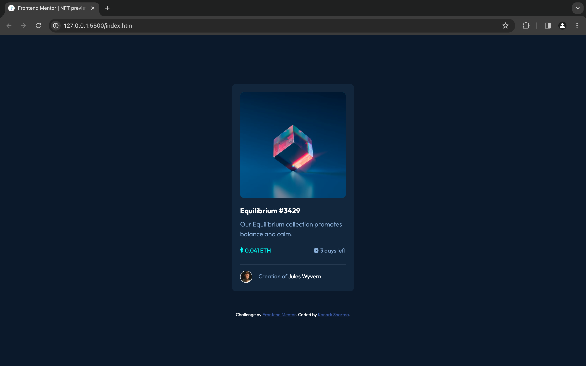

# Frontend Mentor - NFT preview card component solution

This is a solution to the [NFT preview card component challenge on Frontend Mentor](https://www.frontendmentor.io/challenges/nft-preview-card-component-SbdUL_w0U). Frontend Mentor challenges help you improve your coding skills by building realistic projects. 

## Table of contents

- [Overview](#overview)
  - [The challenge](#the-challenge)
  - [Screenshot](#screenshot)
  - [Links](#links)
- [My process](#my-process)
  - [Built with](#built-with)
  - [What I learned](#what-i-learned)
- [Author](#author)

## Overview

### The challenge

Users should be able to:

- View the optimal layout depending on their device's screen size
- See hover states for interactive elements

### Screenshot

### Links

- Solution URL: [Solution](https://www.frontendmentor.io/solutions/nft-preview-card-component-solution-fxXKdea1Ix)
- Live Site URL: [Live](https://konarksharma13.netlify.app/nft%20preview%20card%20component/)

## My process
- Configured the development environment with the necessary dependencies.
- Ensured compatibility with web standards and best practices.
- Addressed any bugs or issues identified during the testing phase.
- This process reflects my journey in acquiring the skills needed to create a versatile and efficient QR code scanner template for web applications.
  
### Built with

- Semantic HTML5 markup
- CSS custom properties
- Flexbox
- Mobile-first workflow

### What I learned

Today, I learned how to create a NFT preview card component that can be incorporated into websites to enhance functionality and user convenience.

## Author

- Frontend Mentor - [@Konarksharma13](https://www.frontendmentor.io/profile/Konarksharma13)
