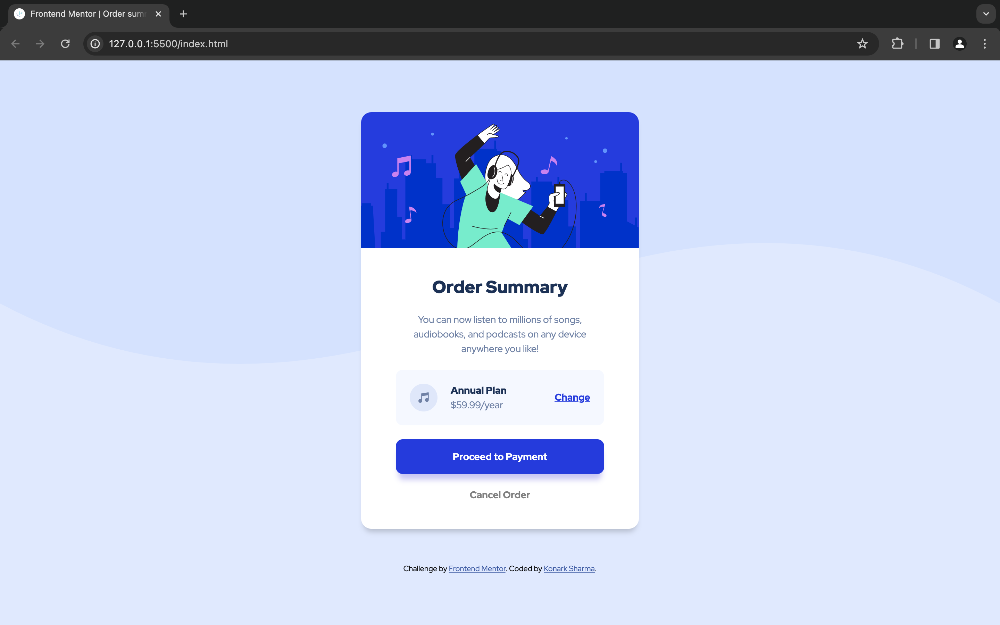

# Frontend Mentor - Order summary card solution

This is a solution to the [Order summary card challenge on Frontend Mentor](https://www.frontendmentor.io/challenges/order-summary-component-QlPmajDUj). Frontend Mentor challenges help you improve your coding skills by building realistic projects. 
## Table of contents

- [Overview](#overview)
  - [The challenge](#the-challenge)
  - [Screenshot](#screenshot)
  - [Links](#links)
- [My process](#my-process)
  - [Built with](#built-with)
  - [What I learned](#what-i-learned)
  - [Useful resources](#useful-resources)
- [Author](#author)

## Overview

### The challenge

- Build out the project to the designs provided

### Screenshot

### Links

- Solution URL: [Solution](https://www.frontendmentor.io/solutions/order-summary-component-solution-ssDK7Pfxjy)
- Live Site URL: [Live](https://order-summary-component-konarksharma13s-projects.vercel.app/)

## My process

- Configured the development environment with the necessary dependencies.
- Ensured compatibility with web standards and best practices.
- Addressed any bugs or issues identified during the testing phase.
- This process reflects my journey in acquiring the skills needed to create a versatile and efficient Order Summary Component for web applications.

### Built with

- Semantic HTML5 markup
- CSS custom properties
- Flexbox
- Mobile-first workflow
- Responsive Web Design
- Box Shadow

### What I learned

Today, I learned how to create a Order Summary component that can be incorporated into websites to enhance functionality and user convenience.

### Useful resources

- [Box Shadow](https://css-tricks.com/almanac/properties/b/box-shadow/) - This is an amazing article which helped me finally understand box-shadow. I'd recommend it to anyone still learning this concept.

## Author

- Frontend Mentor - [@Konarksharma13](https://www.frontendmentor.io/profile/Konarksharma13)

