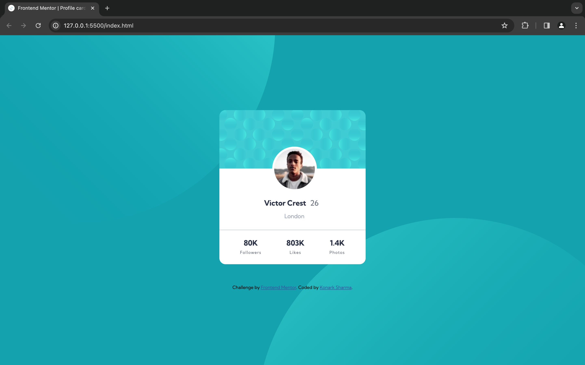

# Frontend Mentor - Profile card component solution

This is a solution to the [Profile card component challenge on Frontend Mentor](https://www.frontendmentor.io/challenges/profile-card-component-cfArpWshJ). Frontend Mentor challenges help you improve your coding skills by building realistic projects. 

## Table of contents

- [Overview](#overview)
  - [The challenge](#the-challenge)
  - [Screenshot](#screenshot)
  - [Links](#links)
- [My process](#my-process)
  - [Built with](#built-with)
  - [What I learned](#what-i-learned)
  - [Useful resources](#useful-resources)
- [Author](#author)

## Overview

### The challenge

- Build out the project to the designs provided

### Screenshot

### Links

- Solution URL: [Solution](https://www.frontendmentor.io/solutions/profile-card-component-solution-ToJ26QFsPB)
- Live Site URL: [Live](https://profile-card-component-konarksharma13s-projects.vercel.app/)

## My process

- Configured the development environment with the necessary dependencies.
- Ensured compatibility with web standards and best practices.
- Addressed any bugs or issues identified during the testing phase.
- This process reflects my journey in acquiring the skills needed to create a versatile and efficient Profile Card Component for web applications.

### Built with

- Semantic HTML5 markup
- CSS custom properties
- Flexbox
- SVG as CSS background
- Media Queries
- Responsive Web Design

### What I learned

Today, I learned how to create a Profile Card Component that can be integrated into websites to improve functionality and enhance user convenience. Additionally, I acquired knowledge about utilizing multiple SVGs as CSS backgrounds and refreshed my understanding of CSS media queries.

### Useful resources

- [How to add SVGs with CSS (background-image)](https://www.svgbackgrounds.com/how-to-add-svgs-with-css-background-image/) - This helped me on putting svg's as a background in a HTML page. I really liked learning about the svg background.
- [CSS Media Queries - Examples](https://www.w3schools.com/css/css3_mediaqueries_ex.asp) - This is an amazing article which helped me  understand CSS Media Queries. I'd recommend it to anyone still learning this concept.

## Author

- Frontend Mentor - [@Konarksharma13](https://www.frontendmentor.io/profile/Konarksharma13)

