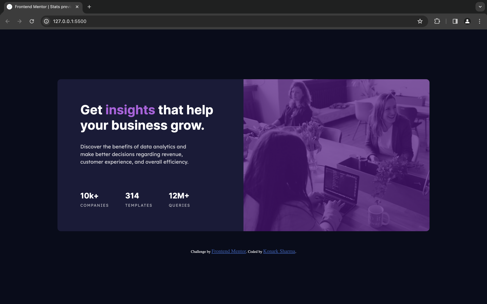

# Frontend Mentor - Stats preview card component solution

This is a solution to the [Stats preview card component challenge on Frontend Mentor](https://www.frontendmentor.io/challenges/stats-preview-card-component-8JqbgoU62). Frontend Mentor challenges help you improve your coding skills by building realistic projects. 

## Table of contents

- [Overview](#overview)
  - [The challenge](#the-challenge)
  - [Screenshot](#screenshot)
  - [Links](#links)
- [My process](#my-process)
  - [Built with](#built-with)
  - [What I learned](#what-i-learned)
  - [Useful resources](#useful-resources)
- [Author](#author)

## Overview

### The challenge

Users should be able to:

- View the optimal layout depending on their device's screen size

### Screenshot

### Links

- Solution URL: [Solution](https://www.frontendmentor.io/solutions/stats-preview-card-component-solution-9zHSN8QU0q
)
- Live Site URL: [Live](https://konarksharma13.netlify.app/stats%20preview%20card%20component/)

## My process

- Configured the development environment with the necessary dependencies.
- Ensured compatibility with web standards and best practices.
- Addressed any bugs or issues identified during the testing phase.
- This process reflects my journey in acquiring the skills needed to create a versatile and efficient Stats preview card component for web applications.

### Built with

- Semantic HTML5 markup
- CSS custom properties
- Flexbox
- Mobile-first workflow
- Responsive Web Design

### What I learned

Today, I learned how to create a Stats preview card component that can be incorporated into websites to enhance functionality and user convenience.

### Useful resources

- [CSS image overlay](https://imagekit.io/blog/css-image-overlay/#image-overlay-effects-using-css) - This is an amazing article which helped me understand CSS image overlay. I'd recommend it to anyone still learning this concept.

## Author

- Frontend Mentor - [@Konarksharma13](https://www.frontendmentor.io/profile/Konarksharma13)

